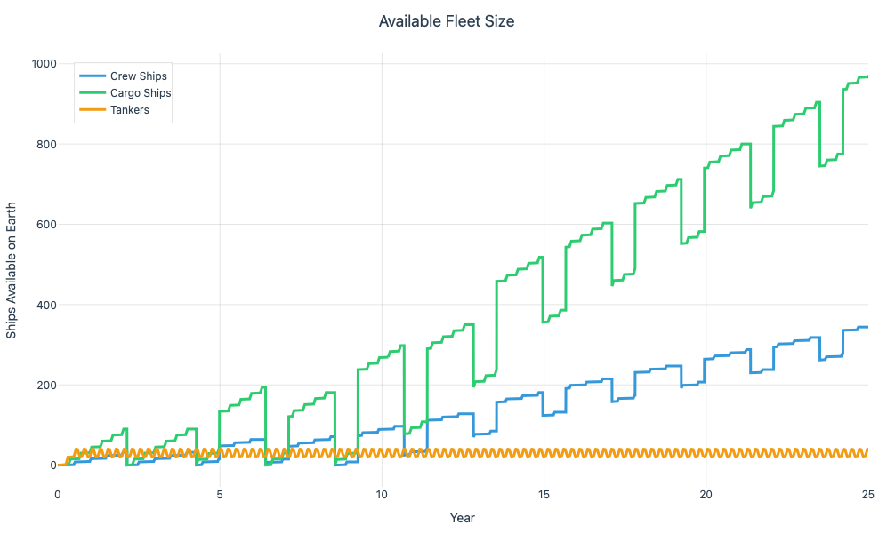
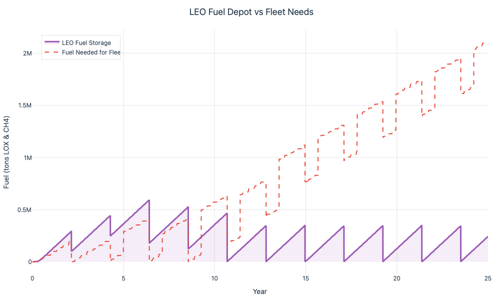

# How Long Will It Take to Build a Research Base on Mars?

Jim was excited for today. He’d been looking forward to the next series of resupply landings ever since the station had run out of ketchup four months ago. The food was never great at Musk Manor—what the inhabitants of the officially titled International Martian Advanced Research Station, or IMARS, called their home—but ketchup at least made the rations feel like food. Soon enough, the first of over 300 resupply ships would begin landing, and Jim would finally get his hands on some sweet, non-Newtonian tomato product.

Jim is a researcher working on optimizing solar power generation. He hopes that, in addition to cementing IMARS as a permanent research station, his work will aid Earth’s transition to renewable energy and pave the way for other outposts to be established on other planets.

Research like Jim’s, done on Mars, is likely to accelerate and enable the further expansion of humanity into the solar system—while also driving the development of technologies useful here on Earth. The engineering and infrastructure needed to support a Martian outpost will form a blueprint for establishing ourselves on Venus, in the asteroid belt, and beyond. But how long will it actually take to establish a large scientific outpost on Mars?

⸻

Scaling the Outpost

Settling a sizeable scientific and engineering outpost on Mars will require massive logistical support from Earth. To estimate infrastructure needs, I’m borrowing an analogy: the USS Gerald R. Ford (CVN-78) aircraft carrier. Aircraft carriers are large vessels capable of supporting thousands of people and tons of equipment. They’re also relatively self-sufficient for limited periods of time, with extensive onboard fuel and food storage.

The Ford supports 4,600 personnel with a displacement of 101,000 tons—roughly 22 tons per person. The analogy holds because much of the mass onboard (aircraft, weapons, reactors) can be reimagined as life support, ISRU systems, and scientific equipment. Assuming a Martian research outpost of 5,000 people, we estimate a target deployment mass of 110,000 tons.

⸻

The SpaceX Architecture

The Mars architecture outlined by SpaceX envisions multiple tanker-class Starships ferrying fuel to a low Earth orbit (LEO) depot. These tankers can launch more or less continuously (aside from some turnaround time), since they only fly to LEO and back.

Crew and cargo-class ships will launch and refuel at the depot. Every 780 days—a Martian synodic period—a growing flotilla of these ships will depart for Mars. The journey takes roughly 250 days. Upon landing on the Martian surface, the ships will be refueled by In-Situ Resource Utilization (ISRU) plants, then wait approximately 18 months for the next return window. After the 250-day trip back to Earth, the ships can be refurbished and added back into the fleet—alongside newly produced vehicles.

This raises several questions:
	•	How many ships will be needed to transport people and equipment to Mars?
	•	How quickly can we build ships?
	•	How much fuel can we get to the LEO depot?

⸻

Building the Simulation

To explore these questions, I built an interactive simulation tool that lets you tweak the parameters of the mission architecture and observe how they affect the timeline for building out a Martian research base.

The simulator models the full end-to-end logistics pipeline: from ship construction and fuel deliveries to launch window synchronization and ISRU-powered return flights. You can adjust variables like:
	•	Ship capacities (people per crew ship, cargo per cargo ship)
	•	Build timelines and production line capacities
	•	Tanker fuel delivery rate and turnaround time
	•	Fleet lifespans and refurbishment limits
	•	Fuel required per Mars round trip

The simulation tracks the system state over a 25-year window, using daily timesteps and realistic constraints. Launch windows occur every 780 days. Each crew or cargo ship must complete a 250-day journey to Mars, spend ~18 months on the surface, and then return during the next window. Tankers deliver fuel to the depot daily. Production lines continuously build new ships, constrained by lead times and line capacity.

⸻

So… How Long Will It Take?

Using a reasonable default configuration:
	•	40 people per crew ship
	•	100 tons of cargo per cargo ship
	•	1 crew ship production line, 4 for cargo, 3 for tankers
	•	Build times of 60 days (crew) and 30 days (cargo/tanker)
	•	Fuel required per Mars mission: 1600 tons
	•	Tanker turnaround: 7 days, each carrying 150 tons of fuel
	•	Launch window every 780 days, with a full round trip taking 1,040 days
	•	Lifespans: 20 missions (crew/cargo), 50 missions (tankers)

…the simulation shows that we can transport 6,240 people and 123,900 tons of cargo to Mars in just six launch windows, or 12.8 years.

That’s more than enough to establish a self-sufficient outpost with a crew of 5,000 and the necessary infrastructure. Even after accounting for retirement and replacement of aging ships, the system supports sustained growth at this scale.

In other words: with a modestly scaled production effort and a few hundred ships, a robust, continuously growing Martian base is not just possible—it’s plausible.

Here’s how the fleet grows across 25 years of continuous shipbuilding and launch window cycles:

Figure 1: Available Fleet Size.
Cargo ships (green) dominate the fleet composition due to their higher production line capacity and shorter build times. Crew ships (blue) grow more slowly, constrained by a single production line. Tankers (orange) cycle rapidly but stabilize at a relatively flat curve, bounded by their mission lifespan.

Notice the sharp drops every 780 days—these are the Mars launch windows, when available ships are dispatched en masse to Mars.

Fuel delivery does not start as the bottleneck in this configuration, but after the early years the fleet size begins to move ahead of the fuel delivery rate.

Figure 2: LEO Fuel Depot vs. Fleet Needs.
The purple area represents cumulative fuel delivered to the depot. The dashed red line shows the fuel demand of the fleet at each launch window. Fuel supply initially exceeds demand—suggesting that fleet size and production cadence, not fuel, are the bottlenecks in base construction at least in the early phases. But after the early years tanker fleet size starts to hinder the ability of the depot to keep up with the demand.

⸻

Assumptions & Reality

Of course, this assumes:
	•	ISRU plants on Mars are reliably producing return fuel
	•	The LEO depot can keep up with tanker deliveries
	•	Launches and landings proceed without catastrophic failures

But under these conditions, the model suggests that a city-scale scientific settlement on Mars is achievable in a little over a decade.

Elon Musk has stated the goal is to produce 1,000 Starships per year. Given that the current lead time for a Falcon 9 is estimated at 12–18 months, this goal might seem fantastical. But SpaceX has a history of compressing timelines that once seemed impossible. For this simulation, I assumed an approximate tenfold increase over Falcon 9’s production rate—roughly one Starship per month per line. This is still speculative, but within the realm of engineering plausibility.

⸻

A Crucible, Not a Colony

Once the floodgates of a functioning base are open—and the nature of the frontier drives invention—capital will begin to flow to Mars. As markets recognize the immense growth potential of not just Mars but a linked, solar system–wide economy, we’ll see the beginnings of an off-world industrial backbone.

At this point, it’s fair to ask: doesn’t this sound a lot like the classic capitalist-imperialist extractive colonization that reached its zenith in the early 20th century?

I think that’s a reasonable concern. But I also think this is different.

This isn’t a resurrection of imperial capitalism. It’s the continuation of human progress that began when our ancestors first stepped out of Africa. It’s tempting to draw a straight line between this project and Earth’s painful history of extractive colonization. But this is something else—not a conquest, but an expansion of possibility space. The goal isn’t plunder, it’s participation. Not domination, but discovery.

Mars is not a colony—it’s a crucible. The logistical challenges of building a Martian research base are immense—but not insurmountable. Not with reusable rockets. Not with well-engineered ISRU. Not with the kind of ambition SpaceX has made plausible. A city on Mars is no longer science fiction. It’s a supply chain problem, and supply chains can be solved.