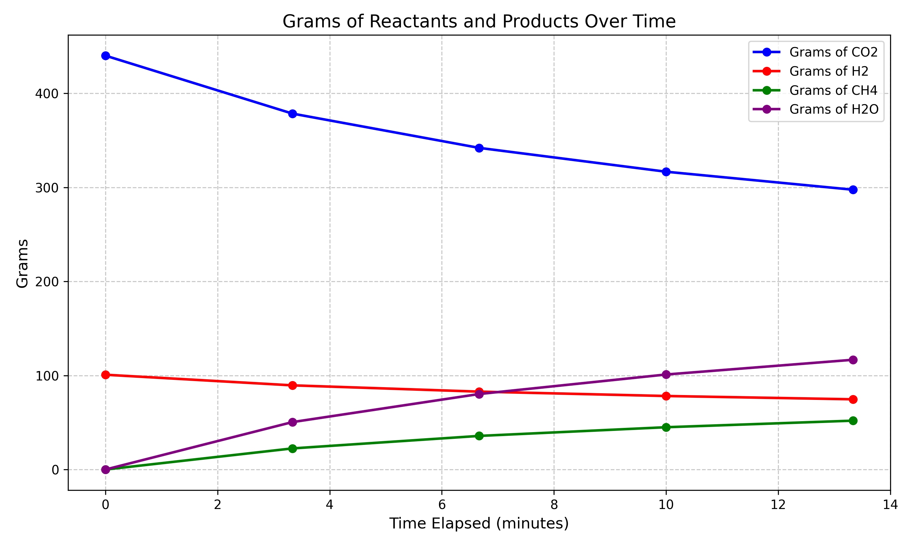

The Methanation reaction in 4 levels of complexity:

Methanation is a chemical reaction that converts carbon dioxide (CO2) and hydrogen (H2) into methane (CH4). This reaction is important in the context of a martian settlement because it can be used to produce methane fuel using atmospheric CO2 and regolith extracted hydrogen. My goal is to simulate a fuel production system. Since I'm not a chemist, i want to start with a simple model and then add complexity as i understand the chemistry better.

The first level of complexity is a simple stoichiometric batch model which assumes isothermal and isobaric conditions and complete conversion of reactants. This first model allows the use of a constant rate of stoichiometric conversion per time step.

$$\frac{d[\mathrm{CO_2}]}{dt} = -r(t), \quad \frac{d[\mathrm{H_2}]}{dt} = -4r(t)$$

$$r(t) = r_0$$

This is about as simple as it gets and is useful for testing, but not very realistic.

Here are the results of a 30 second simulation of this model:

We can see that at a constant rate of 0.5 mol/s, the reaction is complete after 20 seconds as we run out of CO2. So at least in the context of this model CO2 is the limiting reactant and far more H2O is produced (360g) than CH4 (160g). We consume 22g of CO2, 4g of H2, and produce 8g of CH4 and 18g of H2O per second.

Level 2
Level two allows us to model the sabatier reaction in an idealized reactor (PFR). We will utilize a dynamic model that allows the reaction rate to be a function of the concentration of the reactants. This can be modeled using ordinary differential equations which utilize the Arrhenius equation to calculate the rate constant. We can use empirically derived values for the pre exponential factor and activation energy. This still assumes constant flow rates, temperature, and pressure and ideal gas behavior.

TODO: transition to arrhenius equation explanation

The Arrhenius equation calculates the rate constant (k)—the frequency of successfully reacting collisions per unit concentration (moles per liter) per unit time (seconds). It does this by multiplying the theoretical maximum collision frequency (the pre-exponential factor, \(A\)) by the exponential of the negative ratio of the activation energy (\(E_a\)) to the available thermal energy (\(RT\)).

\[ k = A e^{-\frac{E_a}{RT}} \]

- **\( k \)**: the **rate constant**; it links the reaction rate to the relative concentrations of reactants. A larger \( k \) indicates a faster reaction, while a smaller \( k \) indicates a slower reaction.

- **\( A \)**: the **pre-exponential factor**, representing the theoretical maximum collision frequency when there's no activation energy barrier. It reflects both the frequency and correct orientation of molecular collisions. Its units match those of the rate constant, typically expressed as concentration per unit time (\(\text{moles} \cdot \text{L}^{-1} \cdot \text{s}^{-1}\) for second-order reactions).

- **\( E_a \)**: the **activation energy** (in Joules per mole, \(\text{J/mol}\)), representing the minimum energy required for reactants to transform into products.

- **\( R \)**: the **universal gas constant**, equal to `8.314 J/(mol·K)`. It serves as a scaling factor that relates activation energy and temperature to comparable units.

- **\( T \)**: the absolute **temperature** in Kelvin (K), related directly to the average kinetic energy of the reacting molecules. Higher temperatures increase reaction rates by providing more molecules with sufficient energy to surpass the activation energy barrier.

 TODO Explain the PFR model and why the reaction slows down due to dropping inlet flows.