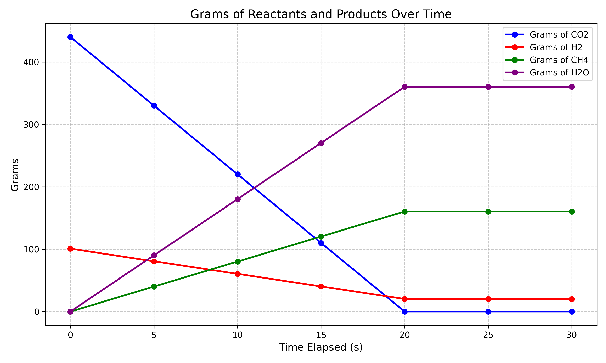
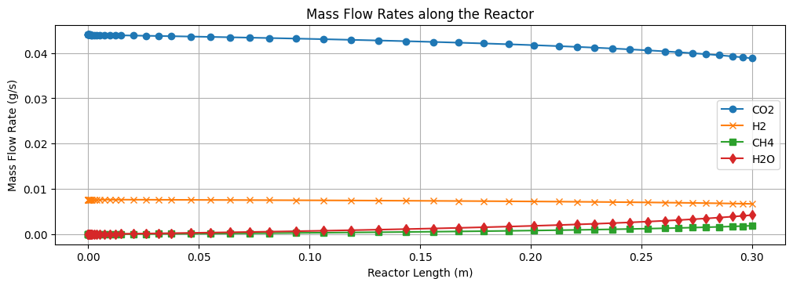
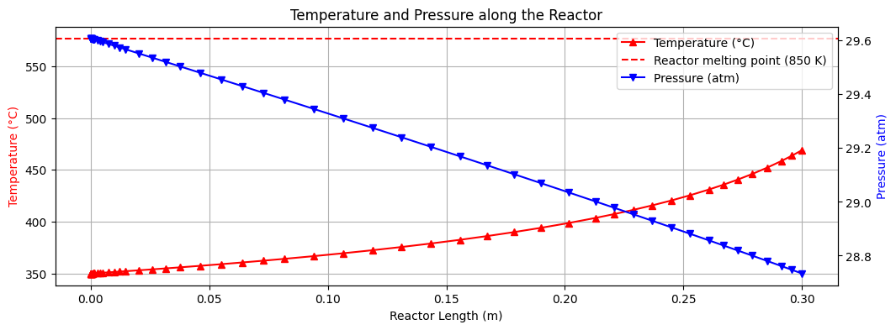

Methanation is a chemical reaction that converts carbon dioxide (\(\text{CO}_2\)) and hydrogen (\(\text{H}_2\)) into methane (\(\text{CH}_4\)). Also known as the Sabatier reaction, this process is used for synthesizing natural gas and as a cleaning step in Haber Bosch based fertilizer production. The methanation reaction is also important in the context of a future Martian settlement because it can be used to produce methane fuel using atmospheric \(\text{CO}_2\) and hydrogen extracted from Martian regolith. My goal is to simulate a fuel production system in an attempt to better understand the process and the challenges involved. Since I'm not a chemist, I want to start with a simple model and then add complexity as I understand the chemistry and the modeling process better.

This is the basic stoichiometry of the reaction.

[comment]: <> (Introduce the stoichiometry of the reaction)

$$\mathrm{CO_2 + 4H_2 \rightarrow CH_4 + 2H_2O}$$ 

We can encode the stoichiometric coefficients as a vector \(\nu\) like so:

$$ \nu = (-1,\,-4,\,+1,\,+2). $$

## Level 1
The first level of complexity is a simple stoichiometric batch model which assumes isothermal and isobaric conditions (that is constant temperature and pressure) and complete conversion of reactants. Essentially this simplifies the system to the level of a constant production volume per time step abstracting away the hairy details of the reactor, feed rates, and the environment. I think it's worth introducing the basic mathematical modeling at this early stage as it will help to demonstrate the effects of adding complexity to the model later.

[comment]: <> (Introduce the governing differential equations, and the rate law)

$$\frac{dC_{\mathrm{CO_2}}}{dt} = -r(t)$$

$$\frac{dC_{\mathrm{H_2}}}{dt} = -\,4\,r(t)$$

$$\frac{dC_{\mathrm{CH_4}}}{dt} = r(t)$$

$$\frac{dC_{\mathrm{H_2O}}}{dt} = 2\,r(t)$$

or more simply:

$$\frac{dC_i}{dt} = \nu_i\, r(t)$$

Where \(C_i\) is the concentration of the \(i\)th species and \(\nu_i\) is the stoichiometric coefficient of the \(i\)th species.

$$r(t) = r_0$$

Where \(r(t)\) is the rate of the reaction at time \(t\) and \(dC_i/dt\) is the change in concentration of the \(i\)th reactant over time.

To summarize these textually: The change in concentration of each of the reactants over time is directly equal to the rate of the reaction multiplied by the stoichiometric vector \(\nu\). 

This is about as simple as it gets and is useful for integration testing with the wider system, but it isn't particularly realistic.

#### Level 1 Results

But again I think it's worth exploring the results of a simulation using this basic model as seeing these results will allow us to place later results into context. Here are the results of a 60 second simulation of this model with a constant rate of 0.5 mol/s:



Starting with 100g of \(\text{H}_2\) and 440g of \(\text{CO}_2\) we can see that at a constant rate of 0.5 mol/s, the reaction is complete after a bit more than 20 seconds as we run out of \(\text{CO}_2\). So at least in the context of this model \(\text{CO}_2\) is the limiting reactant and far more \(\text{H}_2O\) is produced (360g) than \(\text{CH}_4\) (160g). We consume 22g of \(\text{CO}_2\), 4g of \(\text{H}_2\), and produce 8g of \(\text{CH}_4\) and 18g of \(\text{H}_2O\) per second for a total of 160g of \(\text{CH}_4\) and 360g of \(\text{H}_2O\) with around 20g of \(\text{H}_2\) left over.

## Level 2

Level two introduces the Arrhenius equation to calculate the rate constant for the reaction. This increases the complexity of the model but allows more realistic modeling of reaction kinetics. This is similar to the initial $r(t) = r_0$ but we can actually use empirically derived values to calculate the rate constant leading to a more realistic model.

#### Modeling Rate Kinetics: The Arrhenius Equation

The Arrhenius equation calculates the rate constant \(k\)—the frequency of successfully reacting collisions per unit concentration (moles per liter) per unit time (seconds). It does this by multiplying the theoretical maximum collision frequency (the pre-exponential factor, \(A\)) by the exponential of the negative ratio of the activation energy (\(E_a\)) to the available thermal energy (\(RT\)).

[comment]: <> (Introduce the arrhenius equation)

$$ k(T) = A e^{-\frac{E_a}{RT}} $$

- **\( k \)**: rate constant linking rate to concentrations via a rate law. Units depend on overall order; for second-order kinetics they are [L mol\(^{-1}\) s\(^{-1}\)].

- **\( A \)**: the **pre-exponential factor**, representing the theoretical maximum collision frequency when there's no activation energy barrier. It reflects both the frequency and correct orientation of molecular collisions. Its units match those of the rate constant, typically expressed as concentration per unit time [L mol\(^{-1}\) s\(^{-1}\)].

- **\( E_a \)**: the **activation energy** (in Joules per mole, \(\text{J/mol}\)), representing the minimum energy required for reactants to transform into products.

- **\( R \)**: the **universal gas constant**, equal to `8.314 J/(mol·K)`. It serves as a scaling factor that relates activation energy and temperature to comparable units.

- **\( T \)**: the absolute **temperature** in Kelvin (K), related directly to the average kinetic energy of the reacting molecules. Higher temperatures increase reaction rates by providing more molecules with sufficient energy to surpass the activation energy barrier.

We can use empirically derived values for the pre exponential factor and activation energy 


So we can now write the rate law for the reaction as:

$$ r = k(T)\,C_{\mathrm{CO_2}}\,C_{\mathrm{H_2}}^{\,m} $$

\(m\) is the reaction order with respect to \(\text{H}_2\). It reflects how strongly the reaction rate depends on the hydrogen concentration. In practice, the value of m isn’t fixed—it’s usually determined experimentally by fitting reaction rate data, and can vary depending on the operating conditions and the catalyst used.

For the concentration of each species we have a system of ODEs that looks like this:

$$\frac{dC_i}{dt} = \nu_i\, r(t)$$

As you can see this is the same as the level 1 model, showing that the only change is the rate law.

## Level 3
In level three we introduce a reactor model: the Plug Flow Reactor. This is a common model used in chemical engineering to design reactors.

#### Modeling the Plug Flow Reactor (PFR):
 The model consists of a series of infinitely small segments of the reactor volume known as 'plugs'. It is an idealized model that assumes no axial mixing between plugs and radial concentration of reactants is assumed to be constant for any given plug. This model shifts our independent variable from time \(t\) to space \(z\) along the length of the reactor.

$$ \frac{dC_i}{dz} = \frac{\nu_i\, r(z)}{u} $$

Where \(u\) is the velocity of the fluid in (m/s), \(z\) is the axial position along the length of the reactor, and \(r(z)\) is the rate of the reaction at position \(z\). So stated simply, the change in concentration of the \(i\)th species over the length of the reactor is equal to the rate of the reaction at position \(z\) divided by the velocity of the fluid.

In modifying the simulation to use the PFR model we can say that the model's inputs are the feed concentrations \(C_i(0)\) and velocity \(u\). 
As fluid advances in space by \(dz\) species are consumed and produced according to the stoichiometric coefficient \(\nu_i\) and the rate law \(r(z)\). We solve the ODE along the length of the reactor to get the concentration profile at the outlet.

This model isn't particularly realistic, but it's a good starting point for understanding the PFR model. The methanation reaction in particular suffers from the isobaric, isothermal, and constant velocity assumptions.

## Level 4

Level four removes the assumption of constant temperature, pressure, and velocity. This encourages us to restate the governing equations in terms of the molar flow rates \(F_i\) instead of the concentrations \(C_i\) removing a circular dependency between the velocity \(u\) and the pressure \(P\) that would otherwise exist. Here is the new governing equation for the molar flow rates:

$$ \frac{dF_i}{dz} = A \nu_i\, r(z) $$

Where \(F_i\) is the molar flow rate of the \(i\)th species at position \(z\), \(A\) is the cross-sectional area of the reactor, and \(\nu_i\) is the stoichiometric coefficient of the \(i\)th species.

Given this modification the inputs become the inlet molar flow rates \(F_i(0)\) pressure \(P(0)\) and temperature \(T(0)\).

#### Modeling Pressure: The Ergun Equation:
Given that methanation is a gas phase reaction it's important to consider how the velocity of the fluid changes along the length due to molar flow of the reactants and products of the reaction. Methanation must also take place in the presence of a catalyst (Ni or Ru are common) and this is often a packed bed of pellets. The presence of the catalyst creates drag of the fluid dropping the pressure and altering its velocity. 

The Ergun equation allows us to model the pressure gradient \(dP/dz\) as a function of the velocity \(u\), the viscosity \(\mu\), the density \(\rho\) of the fluid as well as the void fraction \(\varepsilon\), and the particle diameter \(d_p\) of the packed bed.

$$\frac{dP}{dz}=-\Bigg[\frac{150(1-\varepsilon)^2}{\varepsilon^3}\frac{\mu\,u}{d_p^2} \;+\; \frac{1.75(1-\varepsilon)}{\varepsilon^3}\frac{\rho\,u^2}{d_p}\Bigg]$$

Where \(dP/dz\) is the pressure per unit length of the packed bed (Pa/m), \(\varepsilon\) is the void fraction (porosity) of the packed bed, \(\mu\) is the viscosity of the fluid, \(\rho\) is the density of the fluid, \(u\) is the velocity of the fluid, and \(d_p\) is the particle diameter (m) of the packed bed.

The first term on the right-hand side (\(\frac{150(1-\varepsilon)^2}{\varepsilon^3}\frac{\mu\,u}{d_p^2}\)) represents laminar flow resistance, while the second term (\(\frac{1.75(1-\varepsilon)}{\varepsilon^3}\frac{\rho\,u^2}{d_p}\)) represents turbulent flow resistance.

It's worth noting that the \(u\) is the superficial velocity of the fluid, not the interstitial velocity. The interstitial velocity is the velocity of the fluid through the voids of the packed bed. The superficial velocity is the velocity of the fluid through the entire cross-sectional area of the reactor.

#### Modeling Temperature: The Energy Balance Equation:

It's also important to consider the energy balance of the reactor. The sabatier reaction is an exothermic reaction, meaning energy (heat) is released as products are formed. This has effects on the local temperature of the reactor. We can model this with an energy balance equation.

$$\frac{dT}{dz}=\frac{-\Delta H_r(T)\,r(z)\,A \;-\; U\,P_w\,[T(z)-T_\infty]}{\,F_\text{tot}(z)\,\bar C_p(z)}$$

Where \(\Delta H_r(T)\) is the heat of reaction at temperature \(T\), \(r(z)\) is the rate of the reaction at position \(z\), \(A\) is the cross-sectional area of the reactor, \(U\) is the overall heat transfer coefficient, \(P_w\) is the perimeter of the reactor, \(T_\infty\) is the ambient temperature, \(F_\text{tot}(z)\) is the total molar flow rate at position \(z\), and \(\bar C_p(z)\) is the average heat capacity of the fluid at position \(z\). Note the negative sign on the heat of reaction indicating that the reaction is exothermic.

Conceptually, the numerator contains the heat of reaction on the left and heat exchange with the wall on the right. The denominator contains the total heat capacity of the fluid at position \(z\).

#### Simulating the PFR

Simulating the PFR to account for variable temperature and pressure requires us to treat some quantities as ODE states \([F_i(z), T(z), P(z)]\) and others as algebraic updates \([F_\text{tot}(z), y_i(z), C_i(z), u(z), \rho(z), r(z)]\). Our ODE states are molar flow rates \(F_i(z)\), temperature \(T(z)\), and pressure \(P(z)\). Total molar flow \(F_\text{tot}(z)\), mole fraction \(y_i(z)\), concentration \(C_i(z)\), velocity \(u(z)\), density \(\rho(z)\), and reaction rate \(r(z)\) are algebraic updates.

Total molar flow \(F_\text{tot}(z)\) is calculated as the sum of the molar flow rates of the species at position \(z\).

$$ F_\text{tot}(z) = \sum_{i=1}^4 F_i(z) $$

Mole fraction \(y_i(z)\) is calculated as the molar flow rate of the \(i\)th species at position \(z\) divided by the total molar flow rate at position \(z\).

$$ y_i(z) = \frac{F_i(z)}{F_\text{tot}(z)} $$

Concentration \(C_i(z)\) is calculated as the mole fraction of the \(i\)th species at position \(z\): \(y_i(z)\), multiplied by the pressure \(P(z)\) divided by the universal gas constant \(R\) and the temperature \(T(z)\).

$$ C_i(z) = y_i(z) \frac{P(z)}{R T(z)} $$


Velocity \(u(z)\) is calculated as the total molar flow rate at position \(z\) multiplied by the universal gas constant \(R\) and the temperature \(T(z)\) divided by the cross-sectional area \(A\) and the pressure \(P(z)\).

$$ u(z) = \frac{F_\text{tot}(z) R T(z)}{A P(z)} $$

Density \(\rho(z)\) is calculated as the pressure \(P(z)\) multiplied by total molar mass of the mixture \(\bar M(z)\) divided by the universal gas constant \(R\) and the temperature \(T(z)\).

$$ \bar M(z) = \sum_{i=1}^4 y_i(z)\,M_i $$

$$ \rho(z) = \frac{P(z)\,\bar M(z)}{R\,T(z)} $$

Reaction rate is the same as the level 2 model.

$$ r(z) = k(T)\,C_{\mathrm{CO_2}}\,C_{\mathrm{H_2}}^{\,m} $$

#### Level 4 Results



The results of the level 4 model are shown above. We can see a obvious rise in \(\text{CH}_4\) and \(\text{H}_2O\) product flow and temperature as we move from the inlet to the outlet of the reactor demonstrating the exothermic nature of the reaction.

```
Residence time ≈ 0.054 s
Outlet molar flow of CO2: 0.88 mol/s, 0.038832 g/s, 2.329937 g/min, 139.796235 g/h
Outlet molar flow of H2: 3.33 mol/s, 0.006712 g/s, 0.402706 g/min, 24.162348 g/h
Outlet molar flow of CH4: 0.12 mol/s, 0.001887 g/s, 0.113233 g/min, 6.793978 g/h
Outlet molar flow of H2O: 0.24 mol/s, 0.004239 g/s, 0.254315 g/min, 15.258895 g/h
Outlet stream percentage of CO2: 19.33%
Outlet stream percentage of H2: 72.94%
Outlet stream percentage of CH4: 2.58%
Outlet stream percentage of H2O: 5.15%
```

This model, while more complex, is still a simplification of the real world. It doesn't account for the effectiveness of the catalyst, non-ideal gas behavior, side reactions, and other factors that would affect the reaction rate and product yield. However, it's a good starting point for understanding the methanation reaction and the challenges involved in modeling it. I plan to extend the model to include these factors in future posts.

## Appendix:
#### Code for level 4
```python
UNIVERSAL_GAS_CONSTANT = 8.314462618 # J/mol K

# Reactor parameters (PFR)
REACTOR_LENGTH = 0.3 # m
REACTOR_DIAMETER = 0.045 # m
CROSS_SECTIONAL_AREA = np.pi * (REACTOR_DIAMETER / 2)**2 # m^2 (circular)
PERIMETER = np.pi * REACTOR_DIAMETER # m (circular)

# Packed bed parameters
POROSITY = 0.4 # unit-less
PARTICLE_DIAMETER = 0.01 # m

# Energy balance parameters
HEAT_TRANSFER_COEFFICIENT = 150 # W/m^2 K
TEMPERATURE_AMBIENT = 298.15 # K
VISCOSITY = 2.0e-5 # Pa s (viscosity of fluid) [constant, could be a function of temperature]

SPECIES_MASSES = np.array([
    44.0095e-3, # co2, kg/mol
    2.01588e-3, # h2, kg/mol
    16.0425e-3, # ch4, kg/mol
    18.01528e-3 # h2o, kg/mol
])

SPECIES_HEAT_CAPACITIES = np.array([
    37.1, # co2, J/mol/K
    28.8, # h2, J/mol/K
    35.7, # ch4, J/mol/K
    34.0 # h2o, J/mol/K
])

STOICHIOMETRIC_COEFFICIENTS = np.array([
    -1, # co2
    -4, # h2
    1, # ch4
    2 # h2o
])

# Kinetics
PRE_EXPONENTIAL_FACTOR = 1.0e4 # m^3/(mol·s)
ACTIVATION_ENERGY = 80e3 # J/mol
MH2 = 1.0 # order w.r.t. H2
DELTA_ENTHALPY_REACTION = -165e3 # J/mol

def rate_constant_arrhenius(temperature):
    return PRE_EXPONENTIAL_FACTOR * np.exp(-ACTIVATION_ENERGY / (UNIVERSAL_GAS_CONSTANT * temperature))

def mixture_properties(molar_flow_rates, temperature, pressure):
    # F_tot, y_i, C_i, bar M, rho, u
    total_molar_flow_rate = np.sum(molar_flow_rates) # F_tot(z)
    total_molar_flow_rate = max(total_molar_flow_rate, 1e-12) # avoid division by zero
    
    species_mole_fractions = molar_flow_rates / total_molar_flow_rate # y_i(z)
    species_concentrations = species_mole_fractions * (pressure / (UNIVERSAL_GAS_CONSTANT * temperature)) # C_i(z)
    mixture_molar_mass = np.dot(species_mole_fractions, SPECIES_MASSES) # bar M(z)
    mixture_density = (pressure * mixture_molar_mass) / (UNIVERSAL_GAS_CONSTANT * temperature) # rho(z)
    
    superficial_velocity = (total_molar_flow_rate * UNIVERSAL_GAS_CONSTANT * temperature) / (CROSS_SECTIONAL_AREA * pressure) # u(z)
    
    return total_molar_flow_rate, species_mole_fractions, species_concentrations, mixture_molar_mass, mixture_density, superficial_velocity

def ergun_dp_dz(velocity, density):
    laminar_flow_resistance = ((150 * (1 - POROSITY)**2) / (POROSITY**3)) * ((VISCOSITY * velocity) / (PARTICLE_DIAMETER**2))
    turbulent_flow_resistance = ((1.75 * (1 - POROSITY)) / (POROSITY**3)) * ((density * velocity**2) / (PARTICLE_DIAMETER))
    return -(laminar_flow_resistance + turbulent_flow_resistance)

def energy_balance_dt_dz(total_molar_flow_rate, reaction_rate, temperature, heat_capacity_of_mixture):
    heat_of_reaction = -DELTA_ENTHALPY_REACTION * reaction_rate * CROSS_SECTIONAL_AREA
    heat_exchange_w_environment = -HEAT_TRANSFER_COEFFICIENT * PERIMETER * (temperature - TEMPERATURE_AMBIENT)
    heat_capacity_of_fluid = total_molar_flow_rate * heat_capacity_of_mixture
    return (heat_of_reaction + heat_exchange_w_environment) / heat_capacity_of_fluid

def calculate_reaction_rate(rate_constant, species_concentrations):
    # r = k * C_CO2 * C_H2^mH2
    return rate_constant * species_concentrations[0] * species_concentrations[1]**MH2

def pfr_rhs(z, y):
    molar_flow_rates = y[:4] # mol/s (molar flow rates)
    temperature = y[4] # K (temperature)
    pressure = y[5] # Pa (pressure)
    
    # Unpack mixture properties
    (total_molar_flow_rate, # mol/s
     species_mole_fractions, # unit-less
     species_concentrations, # mol/m^3
     mixture_molar_mass, # kg/mol
     mixture_density, # kg/m^3
     superficial_velocity # m/s
    ) = mixture_properties(molar_flow_rates, temperature, pressure)

    # Reaction rate
    rate_constant = rate_constant_arrhenius(temperature)
    reaction_rate = calculate_reaction_rate(rate_constant, species_concentrations) # mol/m^3/s
    
    # Energy balance
    df_dz = CROSS_SECTIONAL_AREA * STOICHIOMETRIC_COEFFICIENTS * reaction_rate # mol/s
    dp_dz = ergun_dp_dz(superficial_velocity, mixture_density) # Pa/m
    heat_capacity_of_mixture = np.dot(species_mole_fractions, SPECIES_HEAT_CAPACITIES) # J/mol/K (heat capacity of mixture) [c_p(z) = sum(y_i(z) * c_p_i(z))]
    dt_dz = energy_balance_dt_dz(total_molar_flow_rate, 
                                 reaction_rate,
                                 temperature,
                                 heat_capacity_of_mixture) # K/m    
    return np.array([df_dz[0], df_dz[1], df_dz[2], df_dz[3], dt_dz, dp_dz], dtype=float)
    
# Initial conditions
F0_CO2 = 1.00 # mol/s
F0_H2  = 3.80 # mol/s
F0_CH4 = 0.0 # mol/s
F0_H2O = 0.0 # mol/s
T0 = 623.0  # K
P0 = 3.0e6  # Pa

y0 = np.array([F0_CO2, F0_H2, F0_CH4, F0_H2O, T0, P0], dtype=float)

# Safety events
def stop_negative_flows(z, y): return np.min(y[0:4])
stop_negative_flows.terminal = True
stop_negative_flows.direction = -1

# Aluminum melting point (6061)
def stop_high_temperature(z, y): return y[4] - 850.0
stop_high_temperature.terminal = True
stop_high_temperature.direction = 1

z_span = (0.0, REACTOR_LENGTH)

sol = solve_ivp(
    lambda z, y: pfr_rhs(z, y),
    z_span,
    y0,
    method='BDF',
    rtol=1e-6,
    atol=1e-9,
    events=[stop_negative_flows],
    dense_output=True
)

sol
```


