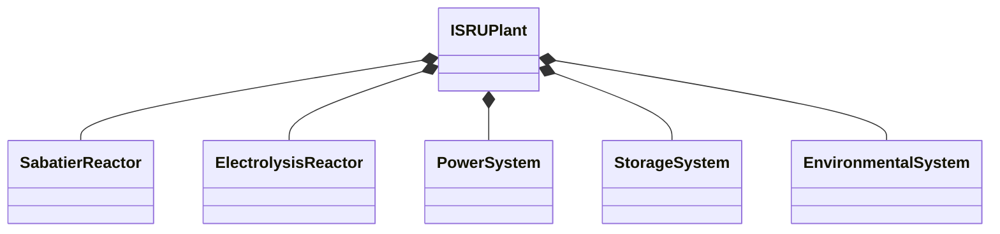

# Object Oriented Analysis & Design Document
## PyISRU: High-Fidelity Martian ISRU Plant Simulation

### 1. System Overview

The PyISRU system simulates a Martian In-Situ Resource Utilization (ISRU) plant with high-fidelity chemical and physical models. The system focuses on accurate representation of chemical processes while maintaining computational efficiency.

### 2. Core Domain Model

#### 2.1 Primary Aggregate: ISRUPlant


The `ISRUPlant` class serves as the aggregate root, orchestrating all subsystems and maintaining global state.

#### 2.2 Key Components

##### Chemical Process Models
```python
class ThermodynamicState:
    temperature: float  # Kelvin
    pressure: float    # Pascal
    enthalpy: float   # Joules
    entropy: float    # J/K
    gibbs_energy: float  # Joules
    
class ReactionKinetics:
    rate_constants: Dict[str, float]
    activation_energy: float
    catalyst_surface_area: float
    reaction_order: Dict[str, int]
```

##### Reactor Systems
```python
class Reactor(ABC):
    thermodynamic_state: ThermodynamicState
    kinetics: ReactionKinetics
    efficiency: float
    operational_status: OperationalStatus
    
class SabatierReactor(Reactor):
    # Primary: CO₂ + 4H₂ ⇌ CH₄ + 2H₂O
    catalyst_type: str  # e.g., "Ru/Al₂O₃"
    side_reactions: List[Reaction]
    catalyst_degradation: float
    
class ElectrolysisReactor(Reactor):
    # 2H₂O → 2H₂ + O₂
    current_density: float
    membrane_efficiency: float
    overpotential: Dict[str, float]
```

##### Storage System
```python
class StorageTank:
    resource_type: ResourceType
    current_volume: float
    max_volume: float
    temperature: float
    pressure: float
    leak_rate: float
```

##### Power System
```python
class PowerSystem(ABC):
    status: PowerSystemStatus
    current_output: float
    fault_condition: Optional[str]

class SolarPanel:
    """Models individual panel behavior"""
    area: float
    efficiency: float
    temperature_coefficient: float
    orientation: tuple[float, float]  # azimuth, elevation
    
    # State tracking
    temperature: float
    dust_coverage: float
    uv_exposure: float
    radiation_exposure: float
    thermal_cycles: int
    
    # Degradation mechanisms:
    # - Temperature effects (-0.4%/K)
    # - UV exposure (2% per year)
    # - Radiation damage (1% per year)
    # - Thermal cycling (5% per 1000 cycles)
    # - Dust accumulation (varies with environment)

class Tracker:
    """Models panel tracking system"""
    type: TrackingType
    power_draw: float
    current_orientation: tuple[float, float]
    is_active: bool
    
    # Tracking types:
    # - None: Fixed orientation
    # - Single axis: East-west tracking
    # - Dual axis: Full sun tracking

class MarsEnvironment:
    """Models Mars environmental conditions"""
    orbital_position: float
    time_of_day: float
    base_opacity: float
    dust_storm_opacity: float
    dust_storm_active: bool
    
    # Environmental factors:
    # - Day/night cycle (24.6 hours)
    # - Seasonal variations
    # - Dust storms (random events)
    # - Atmospheric opacity

class SolarArray(PowerSystem):
    """Models collection of panels with shared tracking"""
    panels: list[SolarPanel]
    tracker: Optional[Tracker]
    environment: MarsEnvironment
    
    # System behavior:
    # - Manages multiple panels
    # - Coordinates tracking
    # - Handles environmental effects
    # - Aggregates power output

class Battery(PowerSystem):
    charge_level: float  # Wh
    temperature: float  # K
    effective_capacity: float  # Wh (degrades over time)
    cycle_count: int
    partial_cycle: float
    last_cycle_dod: float
    
    # Degradation mechanisms:
    # - Temperature effects (-0.2%/K below optimal, -0.1%/K above)
    # - Cycle aging (0.01% per cycle at rated DoD)
    # - Calendar aging (2.5% per year)
    # - Self-discharge (3% per month, doubles every 10K above 20°C)
    
class KrustyReactor(PowerSystem):
    current_thermal_power: float  # W
    temperature: float  # K
    operational_time: float  # seconds
    
    # Degradation tracking:
    fuel_burnup: float        # 0.5% per year at full power
    thermoelectric_deg: float # 1% per year, doubles every 50K above nominal
    material_creep: float     # Temperature dependent, exp(deltaT/50)
    
    # Operational phases:
    # - 30-day burn-in period
    # - Normal operation with multiple degradation mechanisms
    # - Degraded status when total degradation > 10%
```

### 3. High-Fidelity Chemical Models

#### 3.1 Sabatier Process
- Full reaction network including side reactions
- Temperature-dependent equilibrium constants
- Catalyst surface chemistry modeling
- Heat generation and transfer

```python
class SabatierKinetics:
    def calculate_rate(self, 
        co2_concentration: float,
        h2_concentration: float,
        temperature: float,
        catalyst_area: float
    ) -> Dict[str, float]:
        # Returns reaction rates for all species
        pass
```

#### 3.2 Electrolysis Process
- Detailed electrode kinetics
- Nernst equation implementation
- Overpotential calculations
- Current density effects

### 4. Physical Models

#### 4.1 Heat Transfer
```python
class ThermalModel:
    def calculate_heat_transfer(
        self,
        conduction: float,
        convection: float,
        radiation: float
    ) -> float:
        pass
```

#### 4.2 Fluid Dynamics
- Compressible flow calculations
- Pressure drop modeling
- Phase change handling

### 5. Performance Optimizations

1. Parallel Processing
   - Reaction network calculations
   - Heat transfer computations
   - Resource flow calculations

2. Adaptive Time Stepping
   - Variable Δt based on reaction rates
   - Minimum step size for UI updates
   - Maximum step size for stability

3. Caching Strategy
   - Common reaction conditions
   - Equilibrium calculations
   - Thermodynamic properties

### 6. Design Patterns

1. Observer Pattern
   - Time step notifications
   - State changes
   - Resource level monitoring

2. Strategy Pattern
   - Failure modes
   - Reaction pathways
   - Power management

3. Command Pattern
   - User controls
   - System overrides
   - Emergency procedures

### 7. Data Management

#### 7.1 In-Memory State
```python
class SystemState:
    reactors: Dict[str, Reactor]
    tanks: Dict[str, StorageTank]
    power_systems: Dict[str, PowerSystem]
    environmental: EnvironmentalSystem
```

#### 7.2 Persistence
- Checkpointing system state
- Simulation parameters
- Historical data for analysis

### 8. Error Handling

1. Physical Constraints
   - Mass balance validation
   - Energy conservation checks
   - Pressure limits

2. Numerical Stability
   - Integration error bounds
   - Convergence criteria
   - Floating point precision

### 9. Future Extensibility

1. Additional Reactions
   - Modular reaction system
   - Pluggable catalyst models
   - Custom kinetics equations

2. Advanced Features
   - Neural network optimization
   - Predictive maintenance
   - Real-time optimization

### 10. Testing Strategy

1. Unit Tests
   - Individual reaction calculations
   - Component state transitions
   - Error handling

2. Integration Tests
   - Full process flows
   - System stability
   - Resource conservation

3. Performance Tests
   - Reaction network scaling
   - Memory usage
   - Real-time constraints

### 3.4 Power System (Ballot's Solar + Batteries + KRUSTY)

The simulation models a hybrid power system with realistic degradation:

Power Source    | Functionality | Degradation Mechanisms
----------------|---------------|----------------------
Ballot's Solar  | Primary power | - Temperature effects (-0.4%/K)<br>- Dust accumulation (1% per month)
Battery Storage | Peak/Night    | - Temperature effects on capacity<br>- Cycle aging (depth-dependent)<br>- Calendar aging (2.5%/year)<br>- Self-discharge (temp-dependent)
KRUSTY Reactor | Backup/Base   | - Fuel burnup (0.5%/year)<br>- Thermoelectric degradation (1%/year)<br>- Material creep (temp-dependent)

#### Battery System Details
- Optimal temperature range: 20-30°C
- Capacity loss:
  - -0.2% per degree below optimal
  - -0.1% per degree above optimal
  - 20% after 3000 cycles at 80% DoD
  - 2.5% per year calendar aging
- Self-discharge:
  - 3% per month at 20°C
  - Doubles every 10K above 20°C
- Partial cycle tracking using rainflow counting

#### KRUSTY Reactor Details
- Initial 30-day burn-in period
- Three degradation mechanisms:
  1. Fuel burnup: Linear with power output
  2. Thermoelectric: Temperature accelerated
  3. Material creep: Exponential with temperature
- Temperature effects:
  - TE degradation doubles every 50K above nominal
  - Material creep follows modified Larson-Miller model
- Status transitions:
  - ONLINE → DEGRADED at 10% total degradation
  - Maintains partial output in DEGRADED state 